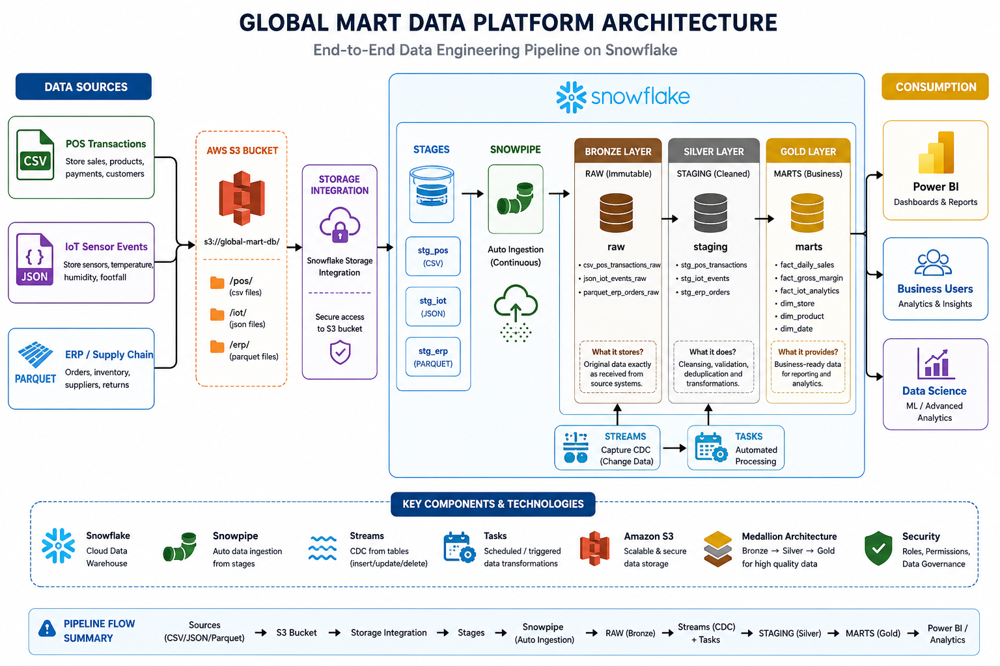

# 🏬 GlobalMart Retail Data Platform


-8A2BE2?style=for-the-badge)


> An end-to-end, fully automated retail data engineering pipeline — from raw files landing in S3 to a live, interactive Power BI dashboard — built entirely on Snowflake.

---

## 📖 About This Project

GlobalMart is a retail business generating data from three very different systems at once: a **point-of-sale system** producing CSV transaction files, **IoT sensors** streaming JSON events from store devices, and an **ERP/supply-chain system** exporting Parquet purchase orders.

This project builds a single, unified data platform that takes all three of these raw, messy, differently-shaped data sources and turns them into one clean, trustworthy, business-ready analytics layer — with **zero manual intervention** after setup. Drop a new file into S3, and within a couple of minutes it has flowed all the way through to the Power BI dashboard, automatically.

## 🏗️ Architecture



The platform follows the **Medallion Architecture** pattern (Bronze → Silver → Gold) entirely inside Snowflake:

- **Sources → S3** — CSV, JSON, and Parquet files land in dedicated folders inside an AWS S3 bucket
- **S3 → Snowflake** — a Storage Integration and external Stages give Snowflake secure, direct access to the bucket
- **Snowpipe** — auto-ingestion continuously and automatically loads any new file the moment it lands, no manual trigger needed
- **🥉 Bronze (raw)** — an untouched, exact copy of every source file, kept for traceability
- **🥈 Silver (staging)** — cleaned, validated, deduplicated, and standardized data, built incrementally using **Streams** (change data capture) and **Tasks** (automated scheduled processing)
- **🥇 Gold (marts)** — a business-ready Star Schema (dimensions + facts), optimized for reporting
- **Consumption** — Power BI dashboards, business users, and data science/ML workflows all read from the Gold layer

## 📂 Repository Structure

```
📁 1. Snowflake Setup/         → database, schemas, storage integration, stages, file formats
📁 2. Bronze Layer/            → raw tables, streams, snowpipes, ingestion
📁 3. Silver Layer/            → staging tables, cleaning + transformation tasks
📁 4. Gold Layer/              → star schema, automation, clustering, materialized views
📁 5. Final check bronze silver gold/  → end-to-end pipeline verification queries
📁 6. PowerBI/                 → dashboard.pbix — the final analytics dashboard
```

Each layer folder (`Bronze`, `Silver`, `Gold`) has its own detailed `README.md` explaining what it does and why.

## ⚙️ Key Components & Technologies

| Component | Role |
|---|---|
| ❄️ **Snowflake** | Cloud data warehouse — the engine behind the entire pipeline |
| 🪣 **Amazon S3** | Scalable, secure landing zone for all raw source files |
| ⚡ **Snowpipe** | Continuous, automatic data ingestion from S3 stages |
| 🌊 **Streams** | Change data capture — tracks exactly what's new since the last run |
| ⏱️ **Tasks** | Scheduled, chained automation — the entire Bronze→Silver→Gold refresh runs on its own |
| 🏅 **Medallion Architecture** | Bronze → Silver → Gold — a proven pattern for progressively higher data quality |
| 🔐 **Security** | Role-based access, storage integrations, and governed permissions throughout |
| 📊 **Power BI** | Final dashboard layer — cards, trend lines, category and store breakdowns |

## 🔄 Pipeline Flow Summary

```
Sources (CSV / JSON / Parquet)
        ↓
    S3 Bucket
        ↓
 Storage Integration
        ↓
      Stages
        ↓
  Snowpipe (Auto Ingestion)
        ↓
   🥉 RAW (Bronze)
        ↓
 Streams (CDC) + Tasks
        ↓
  🥈 STAGING (Silver)
        ↓
   🥇 MARTS (Gold)
        ↓
   Power BI / Analytics
```

## 📊 Dashboard

The final dashboard — **GlobalMart Enterprise Analytics Dashboard** — connects live to the Gold layer and includes:
- KPI cards (Total Revenue, Total Sales, Total Orders, Total Unique Customers)
- Monthly sales & revenue trend
- Category-wise revenue breakdown
- Store-wise performance
- An interactive month slicer

📁 The dashboard file is available here: [`6. PowerBI/dashboard.pbix`](./6.%20PowerBI/dashboard.pbix)

*(Open in Power BI Desktop and hit **Refresh** to pull the latest data from Snowflake.)*

## 🚀 How It Runs

1. A file lands in the S3 bucket (`/pos/`, `/iot/`, or `/erp/`)
2. Snowpipe auto-ingests it into the Bronze layer within seconds
3. A Stream captures the change, and a scheduled Task (every 1 minute) merges it into the Silver layer
4. Silver's completion automatically triggers the Gold layer's dimension and fact refresh tasks
5. Materialized Views and clustered fact tables keep everything fast
6. Power BI is refreshed to pull the latest numbers into the dashboard

No manual SQL execution is required after the initial setup — the entire chain is one connected Snowflake Task DAG.

## 🧑‍💻 Author

**Avani Sharma**

---

## © Copyright & License

Copyright © 2026 Avani Sharma. All Rights Reserved.

This repository, including all SQL scripts, pipeline design, documentation, and the Power BI dashboard, is shared for **portfolio and demonstration purposes only**. No part of this project may be copied, reproduced, redistributed, or used — in whole or in part — for commercial or academic submission purposes without explicit written permission from the author.
